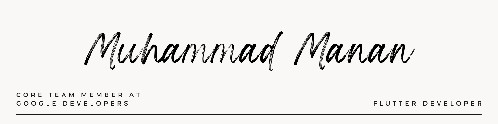

- 👋 Hi, I’m @itsmanan7175
- 👀 I’m interested in Web apps Design & Development
- 🌱 I’m currently learning Flutter, HTML, CSS And JavaScript
- 💞️ I’m looking to collaborate on GDSC And MLSA
- 📫 How to reach me LinkedIn - https://www.linkedin.com/in/itsmanan7175/

<!---
itsmanan7175/itsmanan7175 is a ✨ special ✨ repository because its `README.md` (this file) appears on your GitHub profile.
You can click the Preview link to take a look at your changes.
--->
